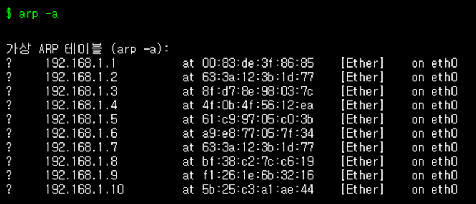
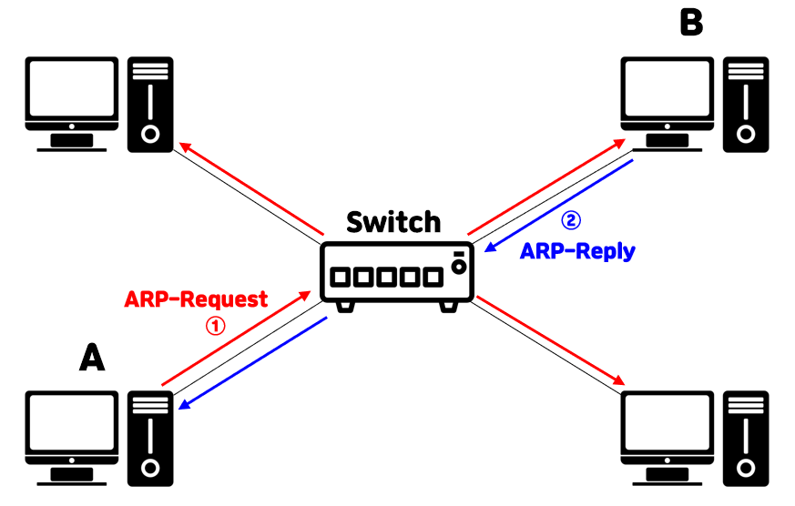

# arp-spoofing
arp-spoofing에 대해서 설명하기 전에 arp에 대해서 알아야한다.

## 1. 주소 결정 프로토콜(Address Resolution Protocol, ARP)란?
  근거리 통신망(LAN)에서는 하나의 Public IP 내에 Private IP로 HOST를 구분한다. 같은 네트워크 상에서 IP주소를 물리적 네트워크 주소(MAC)로 대응하는 역할을 한다.

- ###  ARP 동작 순서
  모든 단말에는 아래와 같이 기기들의 IP주소와 MAC주소가 대응되어 있는 ARP Table이 존재한다.
  
  

  데이터 발신자가 수신자의 MAC주소를 모른다는 가정(ARP Table에 존재X)에 시작한다.

  

  발신자: A, 수신자: B

  1. A는 브로드 캐스트(Broadcast)방식으로 B의 IP주소를 가진 단말이 있는지 물어본다. (ARP Request)
  2. 만약 스위치의 테이블에 수신자의 MAC주소가 저장되어 있다면 발신자에게 알려줌 / B는 자신의 물리주소를 포함하고 있는 ARP Reply 메세지를 보냄

## 2. arp-spoofing이란?

